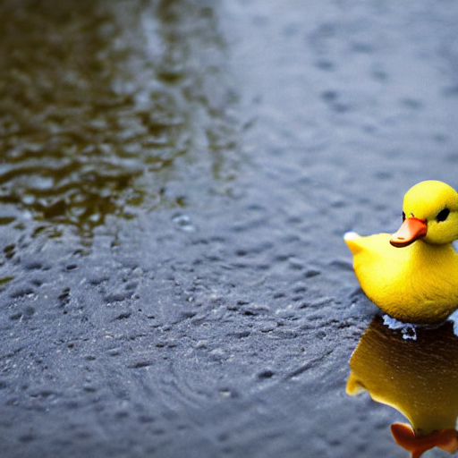
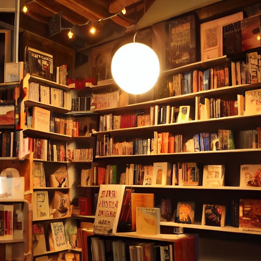
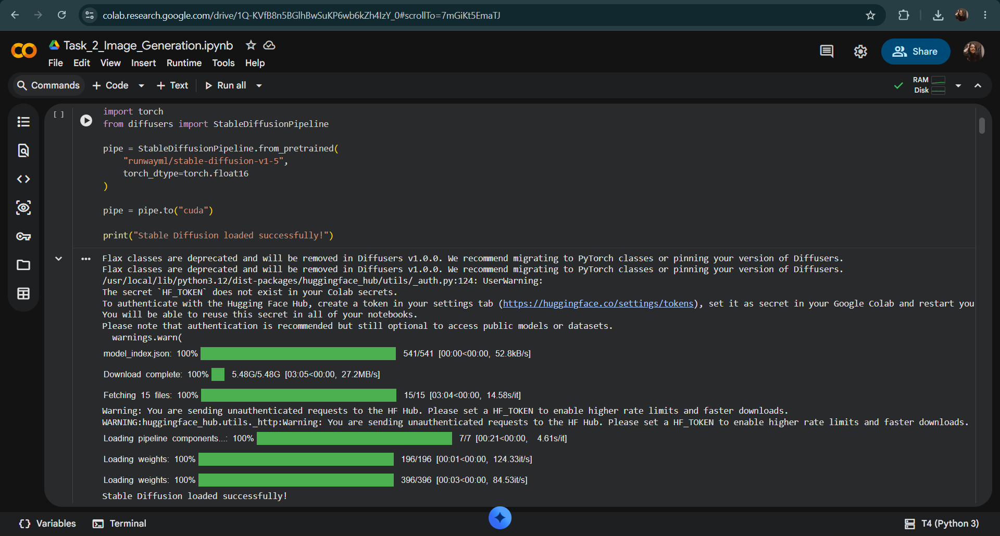
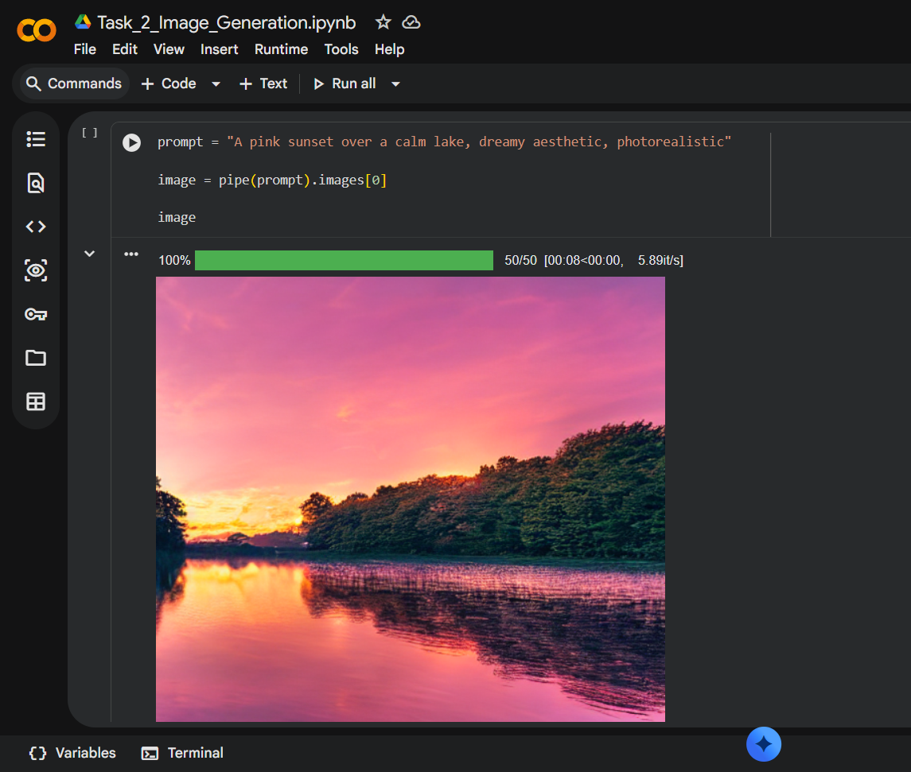

# Text-to-Image Generation using Pre-trained Diffusion Models
> **Task 02 - Generative AI Internship @ Prodigy InfoTech**

---
## Project Overview

This project demonstrates the use of Stable Diffusion, a pre-trained text-to-image generative AI model, to generate realistic and creative images from natural language prompts. By leveraging a diffusion-based model, the project converts textual descriptions into high-quality visual outputs without training a model from scratch.
## Objective

The objective of this project is to generate high-quality images from natural language prompts using the Stable Diffusion pre-trained model. This project also aims to explore prompt engineering techniques and understand how different text descriptions influence the quality and creativity of AI-generated images.
## Technologies Used

- **Python** – Programming language used for implementation.
- **Google Colab** – Cloud-based development environment.
- **Stable Diffusion** – Pre-trained text-to-image generative AI model.
- **Hugging Face Diffusers** – Library for loading and running Stable Diffusion.
- **PyTorch** – Deep learning framework used by the model.
- **CUDA (Tesla T4 GPU)** – GPU acceleration for faster image generation.
## Features

- Generates images from natural language text prompts.
- Uses the pre-trained Stable Diffusion model without additional training.
- Produces creative and realistic AI-generated images.
- Supports experimenting with different prompts and styles.
- Saves generated images for further use and analysis.
## Project Workflow

1. Set up the Google Colab environment.
2. Installed the required Python libraries and dependencies.
3. Loaded the pre-trained Stable Diffusion model.
4. Entered descriptive text prompts.
5. Generated images from the text prompts.
6. Saved the generated images.
7. Uploaded the notebook and generated outputs to GitHub.
## Sample Outputs

Below are a few sample images generated using the Stable Diffusion pre-trained model. Additional generated images are available in the **generated_images** folder.

### Boat

**Prompt:** *A peaceful wooden boat floating on a ocean, in storm, photorealistic.*

---

### Duck in Puddle

**Prompt:** *A tiny duck standing in a puddle, photorealistic.*

---

###  Hot Chocolate

**Prompt:** *A cup of hot chocolate with marshmallows, cozy winter aesthetic, photorealistic.*

---

### 📚 Cozy Library

**Prompt:** *A cozy library with warm lighting, wooden bookshelves, photorealistic.*

## Stable Diffusion Installation

This screenshot shows the successful setup and loading of the Stable Diffusion model.

## Implementation Demo

The screenshot below shows the text prompt, the image generation code, and the generated output in Google Colab.

## Learning Outcomes

Through this project, I:

- Learned how pre-trained Stable Diffusion models generate images from natural language prompts.
- Explored prompt engineering techniques to improve image quality and creativity.
- Gained hands-on experience with Hugging Face Diffusers and PyTorch.
- Understood the workflow of text-to-image generation using diffusion models.
- Successfully implemented and executed the project using Google Colab.

